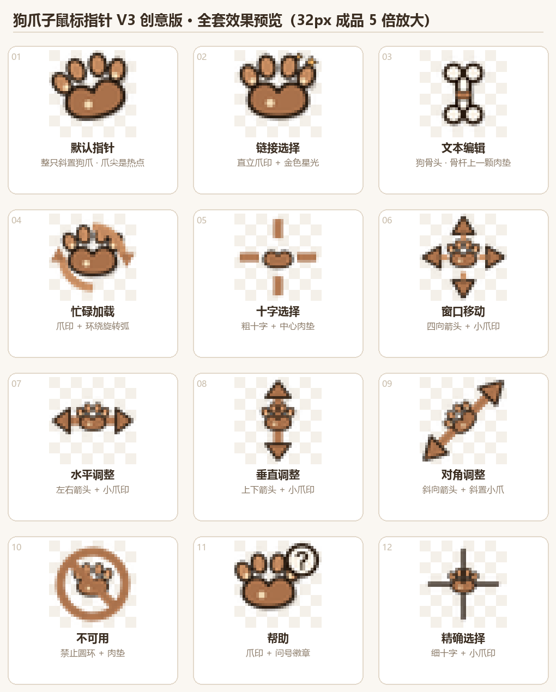

# 🐾 PawCursor — 狗爪子鼠标指针

一套为 Windows 定制的狗爪主题鼠标指针，从设计到 `.cur` 打包全部用 Python + Pillow 代码生成，不依赖任何设计工具。



## 设计理念

32×32 像素下"原生箭头里塞爪印"会挤成一团。V3 版彻底脱离原生形状：

| 光标 | 设计 |
|------|------|
| 默认指针 | 整只斜置狗爪，爪尖即热点 |
| 链接选择 | 直立爪印 + 金色星光 |
| 文本编辑 | 🦴 狗骨头，骨杆上一颗肉垫 |
| 忙碌加载 | 爪印 + 环绕旋转弧 |
| 帮助 | 爪印 + 问号徽章 |
| 其余 7 款 | 高对比粗线条重绘（移动/缩放/禁止/十字/精确） |

**技术要点：** 16 倍超采样（512px 画布）+ LANCZOS 缩小到 32px，保证小尺寸下边缘平滑；`.cur` 文件手工按位打包（BGRA 自底向上 DIB + AND 掩码 + 热点）。

## 目录结构

```
paw_cursor/
├── make_cursors.py        # 核心生成器：绘制 12 款光标并打包 .cur
├── make_preview_big.py    # 生成大尺寸预览图
├── cursors/               # 12 个成品 .cur 文件
├── build/                 # PNG 预览图
├── paw_cursor_set_v1.svg  # V1 设计稿（粉色，已废弃）
└── paw_cursor_set_v2.svg  # V2 设计稿（暖棕写实）
```

## 自己动手生成

```bash
pip install pillow
python make_cursors.py      # 输出到 cursors/ 和 build/
python make_preview_big.py  # 生成大预览图
```

想改颜色 / 形状：编辑 `make_cursors.py` 顶部的色板常量（`PAD` 肉垫棕、`TOE` 趾印浅棕、`GOLD` 金色点缀）即可。

## 安装到 Windows

**方式一（推荐）：** 把 `cursors/` 里的 `.cur` 复制到任意固定目录，然后 `设置 → 蓝牙和其他设备 → 鼠标 → 其他鼠标设置 → 指针`，逐个浏览替换。

**方式二（程序化）：** 写注册表 `HKCU\Control Panel\Cursors` 的 13 个值（Arrow / Hand / IBeam / AppStarting / Wait / Crosshair / SizeAll / SizeNWSE / SizeNESW / SizeWE / SizeNS / No / Help），注销重登生效。

## 恢复默认指针

控制面板指针设置里选"Windows 默认"方案，确定即可。
